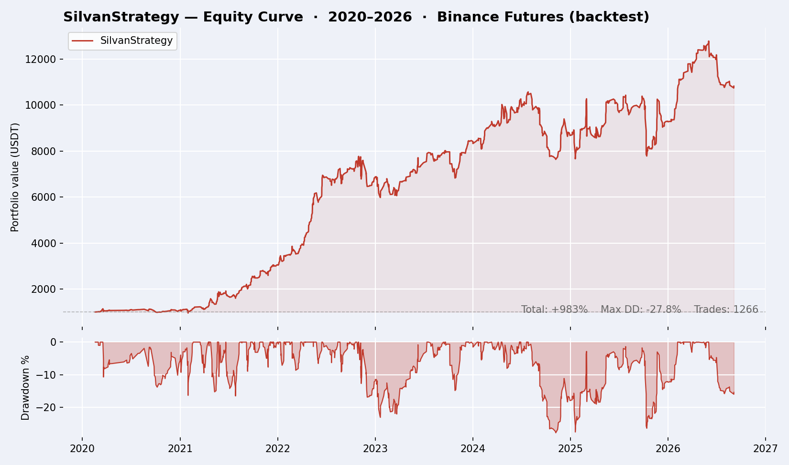
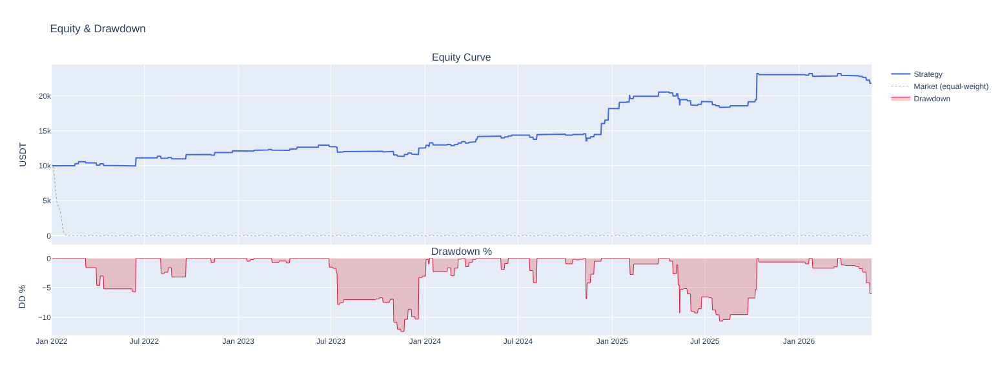
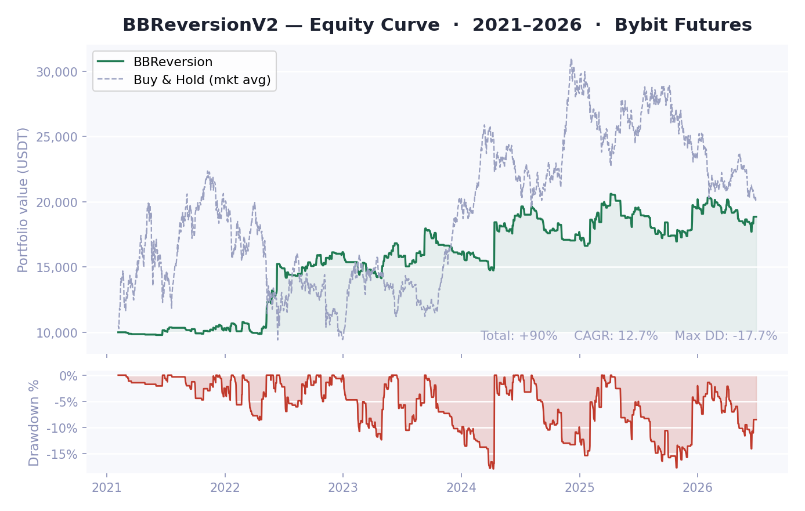
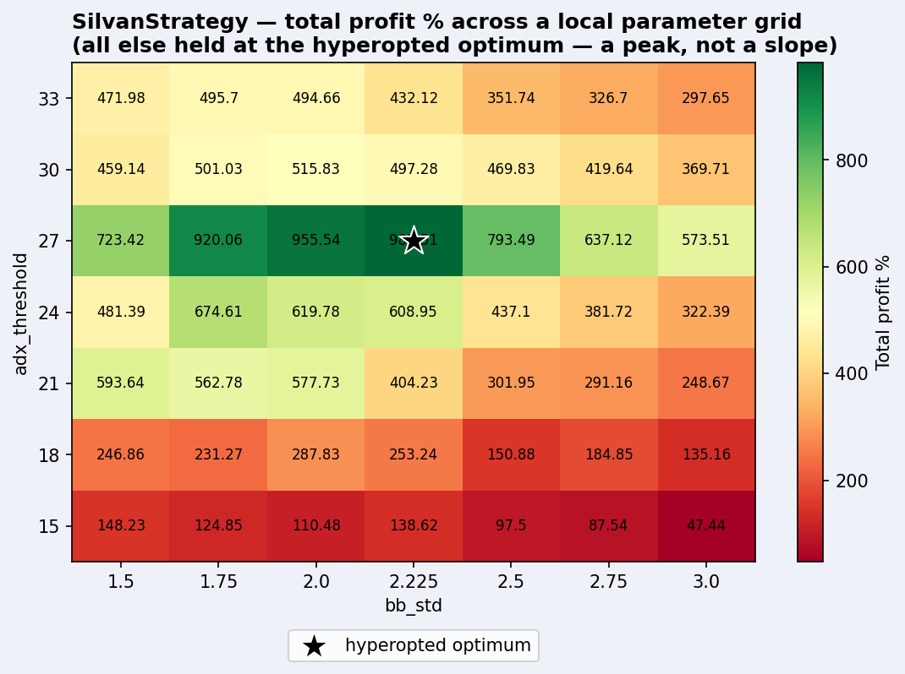
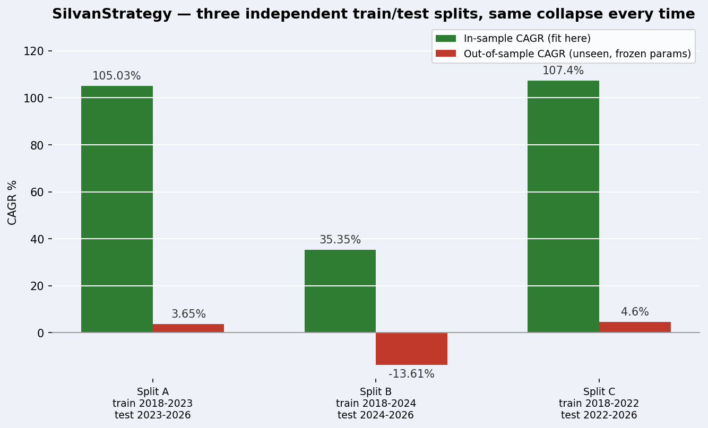

# Freqtrade Strategies

> ⚠️ **Educational repo. Not financial advice.** `SilvanStrategy` below is
> **intentionally overfit** — a deliberate case study, not a strategy anyone
> should trade. See [SilvanStrategy — the magic trick](#silvanstrategy--the-magic-trick).

A small collection of [freqtrade](https://www.freqtrade.io/) strategies I've
built and traded on crypto futures. The code for one of them is published in
full here, deliberately flawed, as a case study on why so many public
freqtrade strategies look great in a backtest and fail live. The other two
run live for real and their code stays private — their weekly results are
published for subscribers on Substack.

## Strategies

### SilvanStrategy

Long+short trend/mean-reversion hybrid on Binance USDT-margined perpetuals,
with a BTC-based regime filter, hyperopted directly on the reported backtest
period. **Educational example — read the breakdown below before drawing any
conclusion from these numbers.**



| Metric | Value |
|---|---|
| Period | 2020 – 2026 (backtest) |
| Total profit | +983% |
| Win rate | 68.3% |
| Sharpe (daily) | 1.48 |
| Calmar | 28.16 |
| Max drawdown | 28.1% |

A Calmar ratio above ~2-3 is already a red flag for a real strategy. 28.16 is
not an edge, it's a tell — see the walk-forward check below.

Code: [`user_data/strategies/SilvanStrategy.py`](user_data/strategies/SilvanStrategy.py)

### DualMomentum

🔒 Private, live-traded. Cross-sectional dual momentum on crypto futures,
running live since mid-2026.



| Metric | Value |
|---|---|
| Period | 2021 – 2026 (backtest, live since 2026) |
| Total profit | +163% |
| Sharpe | 0.97 |

Code and parameters: private. Weekly results & commentary on Substack — see
[`user_data/strategies/DualMomentum/README.md`](user_data/strategies/DualMomentum/README.md).

### BBReversion

🔒 Private, live-traded. Bollinger Band mean reversion on crypto futures,
running live since mid-2026.



| Metric | Value |
|---|---|
| Period | 2021 – 2026 (backtest, live since 2026) |
| Total profit | +90% |
| CAGR | 12.7% |
| Max drawdown | 17.7% |

Code and parameters: private. Weekly results & commentary on Substack — see
[`user_data/strategies/BBReversion/README.md`](user_data/strategies/BBReversion/README.md).

## SilvanStrategy — the magic trick

Named after [Silvan](https://it.wikipedia.org/wiki/Silvan_(illusionista)),
the famous Italian illusionist — because everything impressive about this
strategy's backtest is a trick, not an edge.

It deliberately commits five classic sins that make a huge share of public
freqtrade strategies look amazing on paper and lose money live:

1. **Survivorship bias** — [`config_silvan_backtest.json`](user_data/config_silvan_backtest.json)
   pins a static pairlist of USDT-margined perpetuals on coins that are
   big-cap winners *today* (XRP, BNB, SOL, TRX, DOGE, ADA, LINK, AVAX — BTC
   and ETH are deliberately excluded from trading, too obvious a case).
   Most of these perpetual markets only launched in 2020, so the backtest
   starts there — coins only enter once they're already big enough to have
   a liquid futures market.
2. **Curve-fitted parameters** — every threshold was hyperopted with
   `ProfitDrawDownHyperOptLoss` directly on the exact 2018-2026 timerange the
   headline results above are reported on. No train/test split, no
   walk-forward, no out-of-sample check.
3. **Indicator overload** — six barely-related indicators combined until the
   equity curve looked right, with no economic rationale for why they
   belong together.
4. **Patched weak spot** — the short leg exists for one reason only: the
   long-only version had a real drawdown in the 2022-2023 bear market.
   Instead of accepting that as an honest result, a mirror-image short side
   was bolted on and hyperopted on the very same stretch it's meant to fix.
5. **Hindsight-tuned regime filter** — BTC price vs. its own EMA gates which
   side is allowed to trade, and the EMA length is hyperopted on the same
   period too. BTC itself is never traded, only used as a filter that
   "happens" to know in advance when each regime turns — impossible in real
   time.

**Parameter fragility: a peak, not a slope**

If curve-fitting had produced anything resembling a real edge, nearby
parameter values would perform similarly — a broad, gently-sloping plateau.
Holding every other hyperopted parameter fixed at its "optimal" value and
sweeping `adx_threshold` and `bb_std` on a grid:



Profit rises from 47% at `adx_threshold=15` to a peak of 982% at exactly
`adx_threshold=27` — the value the optimizer landed on — then falls back to
298–472% at `adx_threshold=33`, just 6 units away in either direction.
There's no economic reason "strong enough trend" should mean ADX above 27
specifically rather than 24 or 30; the peak sits there because that's what
this particular six-year window happened to reward.

Not every parameter behaves this way: `regime_ma_len`, `rsi_buy`, and the
two moving-average lengths, swept the same way, produce much smoother
surfaces (`stoploss` and `trailing_stop_positive` show a real cliff too, but
in a direction with a plausible risk-management story — wider stops survive
crypto's violent pullbacks — so it's a weaker example of pure overfitting).
That's worth flagging, because "the parameters aren't sensitive" is
sometimes used as a defense against overfitting, and for those it would
have been true. It just doesn't generalize: some parameters were robust and
the strategy was still worthless out of sample (see the walk-forward check
below). Smoothness in one slice proves nothing about the whole space.

**A sin we didn't include: look-ahead bias**

The five biases above are the "boring", realistic kind — they read like
ordinary strategy-building mistakes, not bugs. There's a more severe, more
common one left out on purpose: look-ahead bias, where the backtest engine
accidentally lets the strategy see data from the future — a custom indicator
computed with a centered rolling window, an informative pair merged without
the delay it would have in real time, a negative `.shift()`. Freqtrade
guards against the obvious cases, but it's easy to reintroduce with custom
indicators or informative pairs.

Look-ahead bias is why some of the "backtest screenshots" floating around
show five- or six-digit percentage returns with near-zero drawdown — numbers
that aren't just optimistic, they're logically impossible in real trading,
because the strategy is trading on information that doesn't exist yet.
SilvanStrategy is kept free of it deliberately: +983% is what curve-fitting
alone can produce, without cheating on time.

**Walk-forward reality check**

The headline numbers above (+983%, Calmar 28.16) come from hyperopting on
the entire 2018-2026 window and reporting the result on that same window —
sin #2. Here's what happens with an honest split: hyperopt only on the
training slice, freeze the parameters, run them unmodified on the rest
(data the optimizer never saw).

A single split invites an obvious objection: maybe the test window just
happened to be an unlucky period, unrelated to overfitting. So this is
repeated with three independent, non-overlapping cut points instead of one:



| Split | In-sample CAGR | Out-of-sample CAGR | In-sample Calmar | Out-of-sample Calmar |
|---|---|---|---|---|
| A — train 2018-2023, test 2023-2026 | 105.03% | 3.65% | 68.63 | 0.44 |
| B — train 2018-2024, test 2024-2026 | 35.35% | **-13.61%** | 15.91 | **-1.28** |
| C — train 2018-2022, test 2022-2026 | 107.40% | 4.60% | 77.87 | 0.48 |

Same strategy, same code, same procedure every time — three different cut
points, three different market regimes in the test windows, and the same
collapse every single time. One split even loses money outright. This isn't
one unlucky test window, it's what happens whenever this strategy meets
data it wasn't fit on. That's the difference between a backtest and a
strategy.

Reproduce it yourself:

```bash
freqtrade backtesting \
  --strategy SilvanStrategy \
  --config user_data/config_silvan_backtest.json \
  --timerange 20180101-20260906
```

The full breakdown of why each of these biases makes the numbers meaningless
— and what a walk-forward, point-in-time-correct backtest looks like instead
— will be in an upcoming article on **[Backtests, not Signals](https://backtestsnotsignals.substack.com)**
(link added here once published).

## Subscribe

Weekly results, walk-forward validation, and the reasoning behind allocation
changes for DualMomentum and BBReversion: **<https://backtestsnotsignals.substack.com>**

## License

Code in this repo is released under the [MIT License](LICENSE). It is
provided for educational purposes only and is not financial advice — see the
disclaimer above.

## Credits

Developed by Alessandro Arrabito with the support of Claude (Anthropic) —
code, backtests, and analysis were AI-assisted, human-directed and verified
throughout.

---

© 2026 Alessandro Arrabito
